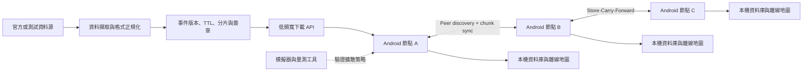

# ResilientGeo Mesh — 系統實作計畫

> 歷史進度快照（截至 2026-09-22）：當時 Flutter 地圖使用 MapLibre + Protomaps PMTiles、本機台灣道路搜尋與三頁 app shell。2026-10-05 已恢復隨 App 提供的 OSM／Protomaps 底圖；zoom 與相機範圍見根目錄 [Map_description.md](Map_description.md)。Android 保留 Room、事件驗證／TTL、版本控管、BLE 與 Emergency Mode。

> 2026-09-27 更新：離線步行路網已擴大到雙北；Pixel 8a 的路線、搜尋、街道拖動與底圖重用實測通過。完整條件與數據見 [雙北路線及效能紀錄](docs/taipei-offline-routing.md)，完成／待辦見 [進度表 G、H 段](docs/mvp-remaining-tasks.md)。

> 2026-10-04 更新：Web 與 Android 共用 NLSC JPG raster PMTiles（相機及來源縮放皆限制 z6–15）、簽章避難所／醫療 layer client 與告警 feed；道路名稱索引、縣市門牌包及雙北步行路網仍是各自獨立資料。17 個縣市門牌包已在本機產生並逐筆驗證，另 5 縣市 unavailable；新 Server 與點位 layer 尚未部署到正式網域。本機暫存點位 bundle 已簽章，但未發布到正式服務或下載到 App。10-04 本機重收集醫療院所 479／24,138 筆已定位，避難處所 5,727／5,973 筆通過座標與行政區核對。逐縣市表見 [點位涵蓋報告](docs/data-coverage-2026-10-04.md)。

> 2026-10-04 同步開發 gate：工作樹新增 `.github/workflows/platform-parity.yml`，對 Pull Request 執行 Node／Server、Flutter Web 與 Android 檢查，彙整為 `platform-parity`。GitHub `main` 的現有 ruleset 尚未要求 CI 狀態；需先讓 workflow 合併並在既有 PR 產生檢查，再將該狀態設為 required。Azure 部署仍為手動流程。

## 目前進度總覽

| 工作項目 | 狀態 | 已完成／尚缺 |
| --- | --- | --- |
| Event、Manifest、Chunk、Peer Summary v0 | 已完成 | `schemas/` 四份 JSON Schema 與 phase-0 fixture 已建立 |
| Phase-0 replay 與測試資料集 | 已完成 | 可重播新增、更新、過期、namespace 隔離與版本倒退；內湖 curated（~27）與 scale（~500）資料集已生成 |
| 階段 2：資料正規化 | 已完成 | `pipeline/lib/normalize.mjs` 可將 TDX-shaped input 轉為 unsigned Event v0 |
| 階段 2：hash、Ed25519、Manifest、Chunk | 已完成 | `pipeline/` 可簽署與驗證完整 bundle，私鑰只由 server-side CLI 使用 |
| 階段 2：安全測試 | 已完成 | Node 測試涵蓋竄改、版本 replay、TTL、incomplete chunk |
| 真實資料源 | Collector 與雙端 layer client 已實作 | `pipeline/sources/` 已有 TDX／CWA／NCDR 與全台靜態來源 adapter；Web／Android 可下載已驗證 layer，但目前沒有正式發布的新點位 layer 或正式服務部署。操作方式見 `docs/frontend-real-data-integration.md` |
| Android 驗證器與 App | 進行中 | Android 驗證器、Room、BLE 與 Flutter map module 已整合；2026-10-05 `:app:assembleDebug` 成功，APK 內含五個 OSM PMTiles。`testDebugUnitTest` 161 項中 157 項通過，3 項 GovernmentFeedSyncTest 與 1 項 EvacuationScenarioTest 失敗；Android 裝置離線安裝驗收尚未完成，完整飛航模式與多機演練也待補測 |
| 雙北離線步行路線 | 已完成本輪驗證 | 預建路網約 28.9 MB，保留內湖資料；41 個行政區連通測試、Pixel 8a 六組短程／兩組較長跨市路線通過。災害類型過濾、高程、兩機災情改道演練仍待完成 |
| 地圖／搜尋延遲 | Pixel 8a profile 驗證通過 | 暖機路線 p95 約 68.6 ms、搜尋運算 p95 約 31.7 ms、街道 Flutter frame total span p95 約 9.1 ms；冷啟動道路索引約 6.8 秒、app PSS 約 1.1 GiB，其他機型與長時間負載待驗證 |
| Android 實機傳輸 Spike | 已完成 | Pixel 7／Pixel 8a 比較後採用 BLE GATT，Nearby Connections／Wi-Fi Direct 已否決；Sharp SH-M32 已補跨品牌驗證。ADR-001 已定案；Emergency Mode 自動同步與鎖屏驗證仍待完成，見 `docs/mvp-remaining-tasks.md` |
| Simulator／實驗報告 | 進行中 | `simulator/` 決定性模擬 10／20／50／100 節點 × 三策略 × 地理過濾；`experiments/` 有可重現的四指標報告（Coverage／Freshness／Cellular Savings／Transfer Efficiency）。部分傳輸參數仍待實機校準；Energy Cost 已完成 Pixel 7 持續發現量測，但尚未涵蓋同步傳輸 |

歷史驗收證據：2026-10-04 的測試涵蓋當時的 NLSC 底圖 PMTiles 產物，以及 Web／Android 本機簽章資料測試。NLSC 下載與顯示數字只代表歷史試用，不是目前 OSM App 的驗收結果。2026-10-04 本機點位收集的逐縣市數字見[點位涵蓋報告](docs/data-coverage-2026-10-04.md)；目前底圖配置見 [Map_description.md](Map_description.md)。本次修改後的測試狀態以本輪 runner 輸出為準。

### Chrome 與 Android 的離線地圖 runtime 邊界

Chrome 開發入口與 release preview 都使用本機 MapLibre GL JS、隨 App 提供的 OSM／Protomaps
PMTiles、style、glyph、sprite、道路搜尋索引與 Flutter UI。Android 從 Flutter bundle
安裝相同的 PMTiles 到 app-private storage。相機縮放、地理邊界及歷史 NLSC 試用範圍見
[Map_description.md](Map_description.md)。Chrome debug 請執行：

```bash
cd flutter
flutter run -d chrome --no-web-resources-cdn --web-port 8787
```

離線 preview 請執行 `flutter build web --release --no-web-resources-cdn`，再以本機
static server 提供 `build/web`。Web 連線後將版本化 PMTiles 分段寫入 OPFS，Android
則由原生 bridge 下載並串流複製到 app-private 目錄；兩者都驗證檔案大小與 SHA-256
後才啟用。窄手機在最低 z6 不一定能同時顯示所有最外側離島，搜尋和平移仍可查看
全台資料範圍。兩個 renderer 允許 label collision、字距與抗鋸齒有細微差異，不依賴
Google Maps、線上 raster tile、線上 geocoder 或外部字型 CDN。

> 2026-09-05 修正：先前記錄的「16 項通過」是 pipeline 測試的舊數字，且當時 Windows checkout 出來的 `fixtures/neihu/*.json` 因 `core.autocrlf=true` 又沒有 `.gitattributes` 而帶 CRLF，跟決定性生成器輸出的 LF 逐位元組比對必然 MISMATCH——這是假失敗，不是生成器不決定性。根目錄 `.gitattributes`（`* text=auto eol=lf`）已修掉這個問題。

## 1. 專案目標

在行動網路低頻寬或局部斷線時，讓 Android 手機仍能：

1. **避免同一份資料被每個人各自從基地台重複下載**——把稀缺的總頻寬留給還沒拿到資料的人，與附近手機交換缺少的更新分片。
2. 查看預先下載的離線地圖。
3. 接收少量、可驗證的災情增量更新。
4. 辨識資料來源、版本、時效與可信狀態。
5. 量測資料擴散速度、節省的行動流量與耗電量。

系統定位是「既有行動網路、衛星、LoRa、基地台車之外的額外韌性層」，不是取代既有通訊，也不宣稱能創造額外的基地台頻寬。

> 2026-09-05 調整：原本第一順位是「查看離線地圖」，把 mesh 同步排在第 3 點且措辭是手段（交換分片）而非價值（減少重複下載）。但題目模擬的是「有訊號但被降到 256 kbps（≈32 KB/s）」，不是完全斷網——在這個情境下 mesh 的價值不是比基地台快（BLE 實測 3–6 KB/s，反而比 256 kbps 慢 5–10 倍），而是題目本身第五點強調的「不要讓 100 個人從基地台重複下載同一份資料」。目標順位改成這個，demo 敘事也應該對應改成「10 台共用 256 kbps、一台下載、九台從 peer 拿到」，而不是「兩台飛航模式互傳」。

## 2. MVP 邊界

### MVP 必須完成

- **平台**：Android First，使用者手動開啟有明顯狀態提示的 Emergency Mode。
- **地圖**：一個測試區域的離線底圖與道路、避難所圖層。
- **資料**：先接一個官方或可重播的測試資料源，轉為統一事件格式。
- **同步**：2–5 台 Android 裝置能發現彼此，只交換缺少的事件分片。
- **可信度**：裝置在寫入資料前驗證雜湊、簽章、版本與 TTL。

### MVP 暫不處理

- iOS 背景 Relay 與 24 小時自動掃描。
- 全台所有 CWA、TDX、NCDR、消防署資料源一次整合。
- 群眾回報的信譽評分與多裝置共識。
- Fountain Code、Erasure Coding 與城市級自動分群。
- 災時正式上線、政府系統整合或安全認證。

## 3. 建議系統架構



### 五個模組

| 模組 | 責任 | MVP 產物 |
| --- | --- | --- |
| Data Pipeline | 擷取、正規化與版本化空間事件 | 可重播的 JSON/Protobuf 測試資料集 |
| Package & Trust | 建立 manifest、chunk、hash、signature、TTL | 能簽署與驗證的資料封包 |
| Android GIS | 儲存離線底圖與事件，顯示新鮮度 | 測試區域地圖與事件圖層 |
| Peer Sync | 發現 Peer、比較版本、交換缺少分片 | 2–5 台實機同步 Demo |
| Experiment Harness | 模擬密度、移動與網路條件 | Coverage、延遲、流量與耗電報告 |

## 4. 核心資料模型

第一版事件至少包含：

```json
{
  "event_id": "tdx:road:382",
  "event_type": "ROAD_CLOSED",
  "geometry": {},
  "severity": "HIGH",
  "source": "TDX",
  "source_version": "135",
  "issued_at": "2026-09-01T06:32:00Z",
  "expires_at": "2026-09-01T08:32:00Z",
  "payload_hash": "sha256:...",
  "signature": "base64:..."
}
```

資料套用規則：

1. 簽章或雜湊驗證失敗：拒絕寫入。
2. 同一 `event_id`：較新且可驗證的版本覆蓋舊版本。
3. 超過 `expires_at`：保留快取但標為過期，不當作目前狀態。
4. 官方資料與群眾回報使用不同 namespace，不能互相覆蓋。
5. 原始來源、接收時間與傳輸來源分開記錄，便於稽核。

## 5. Peer Sync 最小協定

一次連線只做五件事：

1. `HELLO`：交換節點能力、資料集版本與 manifest 摘要。
2. `DIFF`：計算雙方缺少或過期的 chunk。
3. `REQUEST`：依 critical、稀有度、大小與 TTL 排定下載順序。
4. `TRANSFER`：分段傳送，可中斷續傳；同時限制 Peer 數量。
5. `VERIFY/APPLY`：驗證 hash 與 signature 後，以原子方式寫入本機。

傳輸層必須藏在介面後方。階段 0 先用實機 Spike 比較 Nearby Connections 與原生 Wi-Fi Direct／BLE 的相容性、背景限制、速度和耗電，再決定 MVP 實作；不要讓資料同步邏輯綁死單一傳輸 API。

**已知擴展路徑——HELLO 表示法**：`schemas/peer-summary-v0.schema.json` 目前把每個 chunk 的 `chunk_id`／`chunk_hash`／`size_bytes`／`priority`／`state` 逐條列出（實測單條 202 bytes）。內湖 500 筆現況（183 chunk）算下來 HELLO 是 36 KB，BLE @ 4 KB/s 約 9 秒還可接受；但資料集一旦擴到全台規模（數千 chunk），HELLO 會膨脹到數百 KB，在一次 opportunistic contact 的接觸窗內傳不完。v0 不需要現在實作，但先寫下已知方向：**Bloom filter** 或**對 manifest 順序的 bitmap**（有／沒有各 1 bit，183 chunk 只要 23 bytes，比逐條列舉省約 1500 倍）。等階段 3 才發現要換格式時，schema 可能已經被多個模組依賴，屆時代價會高一個數量級。詳見 `docs/peer-sync-v0.md`。

## 6. 開發階段與驗收條件

### 階段 0：證明關鍵假設（2–3 天）

- [x] 定義 Event、Manifest、Chunk 與 Peer Summary 的 v0 格式。（`schemas/`）
- [x] 準備 100–1,000 筆道路／避難所測試事件與更新序列。（`data/fixtures/neihu/scale-v136.json` ~500 筆，`demo-v136/137` 為更新序列；由 `tools/generate-neihu-fixtures.mjs` 從 OSM 快照決定性生成）
- [x] 用兩台 Android 實機測 BLE 發現及傳輸。（BLE GATT，見下方說明——非原規劃的「高速 P2P」方案，實測後 Nearby Connections／Wi-Fi Direct 皆否決，改採 BLE GATT）
- [x] 紀錄連線時間、傳輸速度、斷線恢復結果。（KB 級酬載：10KB/100KB 傳輸與位元組級斷點續傳皆成功，吞吐量 3–6 KB/s；原規劃的 1MB/10MB 是壓力測試數字，非實際酬載大小，見 ADR-001）
- [x] 寫出 ADR-001：MVP 傳輸層選擇與未選方案的原因。（狀態已定案為 Accepted，BLE GATT）

**通過條件**：兩台指定測試機可重複完成發現、連線、傳輸、斷線重試——**條件通過（pending 相容性）**，2026-09-05。目前兩台測試機皆為 Pixel、同一 API 37，尚未滿足 §8 風險表「至少兩個品牌、兩個 Android 版本」的停止條件排除標準；`C_BLEbroadcast.md` 已記錄一台 Samsung SM-S731B（Android 16, API 36）在手，應優先用它補測 discovery/connect/transfer，而非直接視為階段 0 全數通過。

### 階段 1：單機離線系統（第 1 週）

- [x] 顯示台灣離線地圖。（目前 Web 與 Android 使用 App 內附 OSM／Protomaps PMTiles；2026-10-04 的 NLSC JPG raster PMTiles 與下載流程只作歷史試用記錄。道路搜尋索引與雙北路網維持獨立資料。OSM 安裝與離線重開需依本輪 Android build／裝置驗收確認）
- [x] 用本機資料庫保存事件、版本與到期時間。（Room：`data/EventEntity.kt`、`data/EventDao.kt`）
- [x] 將測試事件套到地圖，清楚標示有效、過期與未驗證。（CURRENT/EXPIRED/UNVERIFIED 依 apply rules 上色）
- [x] 完成 delta 套用及新版本覆蓋規則的單元測試。（Node pipeline 測試 + Android `EventIngestorTest`/`RoomEventStoreInstrumentedTest`，已對接 Android DB）

**通過條件**：關閉網路後重啟 App，地圖與最後資料仍可讀；舊事件不能覆蓋新事件。**已在 Pixel 8a 實機驗證（強制關閉 + 飛航模式 + 重開，資料無需重新載入）。** 細節見 `android/README.md`。

### 階段 2：可信資料管線（第 2 週）

- [x] 將一個資料源正規化為 v0 Event。（TDX-shaped 模擬輸入；尚非即時 API）
- [x] 產生 manifest 與固定大小或內容導向的 chunk。
- [x] 在伺服器端簽署，在 Android 端驗證；私鑰不進 App。（server-side Node signing 完成；Android 端 Ed25519 驗簽 adapter 已建立於 `android/app/.../trust/`，使用 Bouncy Castle，私鑰只存在於 fixture 產生腳本執行當下，從未寫入 App）
- [x] 測試竄改、重播、過期與不完整封包。（Node pipeline tests）

**通過條件**：合法資料可寫入；任一位元遭修改、版本倒退或 TTL 到期時，App 都不把它顯示為目前有效資料。

**目前狀態**：資料管線與驗證規則已在 Node／Android 原生測試中建立；Flutter 地圖只讀取 Android 已驗證事件，host debug APK 已建置並包含離線資料，正式 App-level 仍需目標裝置驗收。

### 階段 3：多機同步 Demo（第 3–4 週）

原本一次要完成「協定接線 + 斷線續傳 + Peer 上限 + critical-first 排程 + 三機 SCF + 五機擴展」，但協定層與傳輸層從來沒接過線——`send`／`resume` 目前走的還是階段 0 spike 的隨機測試 payload。2026-09-05 拆成三個子階段，3a 是唯一真正的整合風險點，單獨當里程碑：

**3a — 協定接線（唯一的整合風險點）**

- [ ] 把 HELLO/DIFF/REQUEST 序列化接到 `BleGattTransport`。
- [ ] 兩機交換**一個**真 chunk，通過 `EventVerifier` 寫進 Room。

**3b — 依賴 3a 打通**

- [ ] 接上跨接觸續傳（`pipeline/lib/peer-sync.mjs` 的 `buildRequest()` 目前硬寫 `offset_bytes: 0`，要接上 `BleGattTransport` 已驗證的位元組級續傳）。
- [ ] Peer 上限與 critical-first 排程。
- [ ] **實作 Emergency Mode foreground service**——`android/app/.../transport/` 目前全是 Activity，沒有任何 foreground service；三機 Store-Carry-Forward 需要中繼手機在口袋裡移動時還活著，這是目前唯一已寫在計畫裡、實作還沒開始、而且會直接卡住 3c 的項目。排在協定接線之前或同時開始準備。

**3c — 依賴 3b + foreground service**

- [ ] 用第三台手機驗證 Store-Carry-Forward（A 不直接連到 C 時，更新仍能經 B 到達 C）。

**~~3d — 五機實機擴展~~**：時間緊就砍掉用模擬器代替，邊際資訊量遠低於成本；階段 4 的節點模擬所需參數（接觸率、每次接觸吞吐量）改由 3a/3b 的實測資料提供。

**通過條件**：A 不直接連到 C 時，更新仍能經 B 到達 C；所有收到的資料都通過簽章驗證，且沒有從伺服器重複下載完整資料集。

### 階段 4：實驗與展示（第 5 週）

- [x] 建立 10、20、50、100 節點的可重播模擬情境。（`simulator/`，固定 seed ＋ `sim-config.json` ⇒ 位元相同，`matrix --check` 守住）
- [x] 比較無協作、一般 replication、rarest-first 三種策略。（外加正交的地理相關性過濾開關）
- [ ] 實機量測 Emergency Mode 的耗電與傳輸量。（Energy Cost 尚未建模，需指定機型實機量測）
- [x] 產生 Demo 腳本、限制說明與結果圖表。（`experiments/{demo,limitations}.md`、`results/report.md` 含 ASCII 曲線、`analysis/*.csv`）

**通過條件**：報告可重現，不宣稱固定時間覆蓋全城；所有成果都附測試條件與樣本數。

**目前狀態**：四個指標（Data Coverage、Freshness Lag、Cellular Savings、Transfer Efficiency）已在 `experiments/results/report.md` 產出且可重現（`matrix --check` PASS），每個區塊帶樣本數與 Limitations。接觸機率與 P2P 傳輸參數是工程估計值，待組員 C 的兩台實機 spike 校準（改 `simulator/fixtures/sim-config.json` 一檔即可重跑）。Energy Cost 因需實機量測，本階段尚未宣告完成。

## 7. 必須量測的指標

| 指標 | 定義 | 第一版目標 |
| --- | --- | --- |
| Data Coverage | 指定時間內取得最新事件的節點比例 | 產出 T+1/3/5/10 min 曲線 |
| Freshness Lag | 事件發布到節點成功套用的時間 | 報告 p50、p95，不先承諾絕對值 |
| Cellular Savings | 相對每台各自下載所減少的伺服器流量 | 在固定情境下可重現 |
| Transfer Efficiency | 有效 payload／總 P2P 傳輸量 | 記錄重複與失敗傳輸比例 |
| Energy Cost | Emergency Mode 每小時額外耗電 | 指定機型、電量及掃描頻率 |

## 8. 主要風險與停止條件

| 風險 | 先做的控制 | 停止／改案條件 |
| --- | --- | --- |
| Android 背景限制 | MVP 使用前景服務與明確 Emergency Mode | 鎖屏後無法穩定完成最小同步 |
| 裝置相容性 | 至少兩個品牌、兩個 Android 版本實測 | 傳輸層只能在單一機型運作 |
| 過期或倒退資料 | 簽章、單調版本、TTL、來源優先序 | 無法可靠拒絕舊資料時不進入展示 |
| 電量消耗 | 掃描退避、電量門檻、critical-first | 一小時測試耗電超出可接受門檻時降低掃描頻率 |
| 密度不足 | 明確定位為額外韌性層 | 不以 Mesh 單獨承諾偏遠地區覆蓋 |

## 9. 建議儲存庫結構

```text
docs/                 決策紀錄、協定、實驗設計
schemas/              Event、Manifest、Chunk schema
pipeline/             資料擷取、正規化、分片、簽章
android/              Android Host、Room、事件驗證、BLE、Peer Sync
flutter/              Flutter 地圖主畫面、離線 tiles、marker 與詳情面板
simulator/            DTN／擴散模擬與情境設定（已建立）
experiments/          原始結果、分析腳本與圖表（已建立）
fixtures/             可重播的測試資料，不放正式私鑰
```

## 10. 第一個工作時段（約 90 分鐘）

1. **20 分鐘**：建立 `schemas/event-v0.schema.json`，固定欄位型別與必填值。
2. **20 分鐘**：建立 `schemas/manifest-v0.schema.json`，定義 chunk hash、大小與優先序。
3. **20 分鐘**：建立兩批測試 fixture，包含新增、更新、過期與版本倒退事件。
4. **15 分鐘**：寫出裝置 A/B 預期的 `HELLO → DIFF → REQUEST` 範例。
5. **15 分鐘**：建立 ADR-001 空白模板，列出實機 Spike 要記錄的數據。

完成標誌：不需要 App UI，也能用固定 fixture 清楚回答「哪筆資料更新、哪個 chunk 缺少、哪筆資料必須被拒絕」。

**完成狀態（2026-09-06）**：上述資料契約、fixture、HELLO／DIFF／REQUEST 範例、Android 原生資料層與 Flutter 內湖離線地圖已完成；Emergency Mode 的 Pixel 7 持續發現耗電量測已完成。多機同步協定接線、真實來源接入與同步傳輸耗電量測仍是後續工作。

### Flutter 台灣離線地圖顯示契約

- Web 與 Android 使用隨 App 提供的 OSM／Protomaps 向量 PMTiles；底圖不透過 Server 下載，NLSC 原始 `TaiwanEMap6.mbtiles` 僅保留歷史試用。相機縮放與經緯度限制見 [Map_description.md](Map_description.md)。道路搜尋和步行路網維持獨立資產。
- `flutter/assets/map/search/taiwan-roads.json` 是 Geofabrik Taiwan OSM PBF 衍生的全台道路名稱索引，含來源 URL、SHA-256、snapshot 與 OSM attribution；它不是 OSM／Protomaps 底圖的一部分。道路名稱、別名及經緯度查詢使用本機索引，不呼叫線上 geocoder。門牌搜尋使用另外下載的縣市包，目前 17 個縣市有 `partial` 包，5 個縣市標為 unavailable。
- 地圖上的避難所／醫療點位只來自通過簽章驗證的靜態圖層。若尚無可信下載版本，不回退顯示舊 OSM 醫療快照；未定位院所仍可搜尋名稱、地址與機構資料，但不會用猜測座標當地圖點。2026-10-04 本機直接收集的醫療主檔為 24,138 筆（479 已定位、23,659 未定位），避難處所為 5,973 筆（5,727 已定位、180 未定位、66 排除）；未定位數字是本次本機收集，不表示 Server/App 已更新。已部署 Server 的當前版本仍需查 `/v1/source-status`。`coverage: TW` 本身不代表全部院所都已定位。
- Flutter 載入離線資料期間顯示 `Geo_light_phone_logo.png` 或 `Geo_dark_phone_logo.png`；Android 原生 splash 使用對應的 square logo，透過 `drawable-night` 依系統深色模式切換。
- 路線規劃使用另外的 OSM 衍生雙北步行路網；OSM／Protomaps 向量底圖與道路名稱索引都不構成全台可路由網路。應變告警由簽章 feed 更新；到期或撤銷時移出目前畫面、通知及活躍本機資料。來源檢查成功且沒有有效告警時可發布簽章空 feed；來源失敗則保留可信舊版本。
- 避難所 `capacity` 表示規劃容量；沒有可靠來源的即時收容人數維持 `null`，不補成 0。Android Room 事件仍經 `com.resilientgeo.mesh/events` 提供；Flutter 不直接寫 Room，也不接管信任驗證、TTL、版本控管或 BLE。
